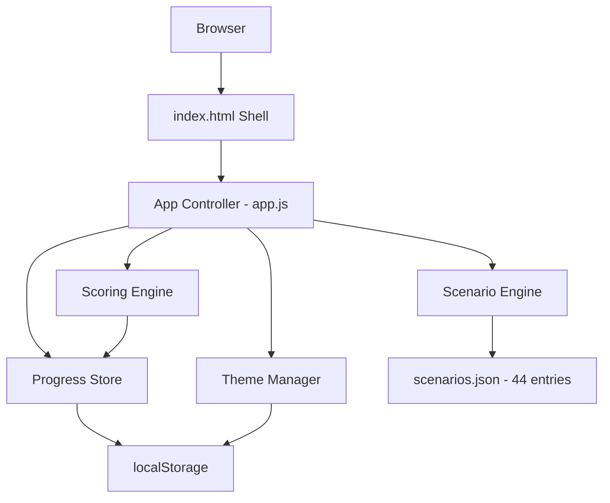
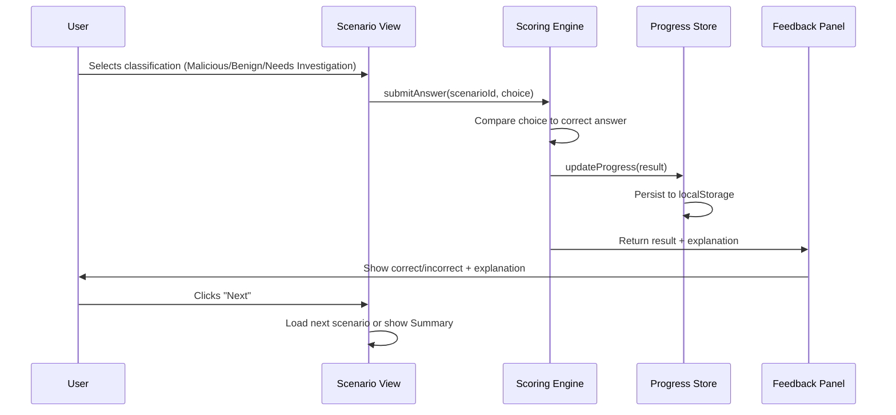
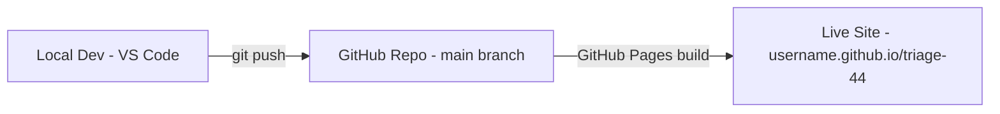
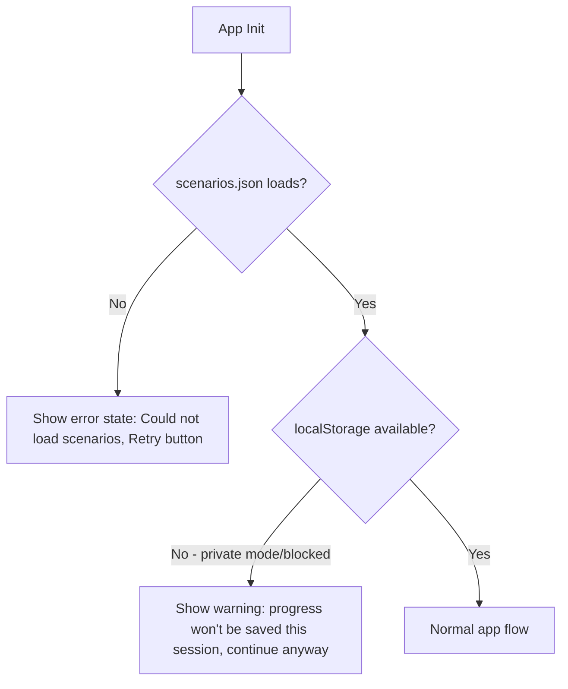

# ARCHITECTURE.md — TRIAGE//44

**Confirmed:** Fully client-side v1 (no backend, no auth, localStorage persistence). This document reflects that decision throughout.

---

## 1. Tech Stack (Final)

| Layer | Choice | Why | Alternatives Considered |
|---|---|---|---|
| Frontend | **Vanilla HTML/CSS/JS** (single-page, no framework) | App has one core interaction loop (scenario → answer → feedback). A framework adds build tooling overhead with no real benefit at this scale. Matches your offline-capable, single-file-first pattern. | React (CDN) — rejected: adds CDN dependency, breaks true offline/`file://` use; unnecessary for this component complexity |
| State Management | **Plain JS module state + localStorage** | App state is small (current index, score, answers, theme). No need for Redux/Zustand. | React Context — rejected, no React in stack |
| Styling | **Vanilla CSS with CSS variables** | Enables dark/light theme via variable swap, no build step, matches existing CyberVidyarthi design system | Tailwind — rejected: needs build tooling for a static single-file app |
| Data Storage | **Browser `localStorage`** | Free, zero-infra, matches "no backend" decision, sufficient for single-device progress tracking | IndexedDB — rejected: overkill for small flat data (44 scenarios + progress object) |
| Content/Scenario Data | **Static JSON file bundled with the app** | 44 fixed scenarios, no need for dynamic fetching | Fetching from an API — rejected: no backend in scope |
| Charts (score visualization) | **Chart.js (CDN)** for the summary screen only | Free, lightweight, only used on the final summary screen, degrades gracefully if offline (summary text still works) | Custom SVG — acceptable fallback if full offline capability is prioritized over Chart.js |
| Icons | **Inline SVG** | No icon library dependency, fully offline-safe | Lucide/Font Awesome CDN — rejected for offline reasons |
| Fonts | **Space Grotesk (display), Inter (body), JetBrains Mono (data)** via Google Fonts CDN, with system-font fallback | Matches CyberVidyarthi brand; system fallback keeps app usable if fonts fail to load | — |
| Hosting | **GitHub Pages (free)** | Free, integrates directly with the GitHub repo, zero-config for static sites | Netlify free tier — equally valid, GitHub Pages chosen for simplicity since repo already lives on GitHub |
| Version Control | **Git + GitHub**, `main` branch, feature commits per build day | Standard, free, already in your workflow | — |
| Testing | **Manual QA pass + Node `--check` syntax validation + jsdom smoke tests** | Matches your standard practice; no complex test framework needed for this scope | Jest/Playwright — optional future addition, not needed for v1 |
| CI/CD | **None for v1** (manual deploy via GitHub Pages branch) | Free, simplest path; app is static with no build step so CI adds little value | GitHub Actions auto-deploy — reasonable Day 10+ enhancement, not required now |
| AI APIs | **None** — scenario content and explanations are static/authored, not generated at runtime (per PRD, this keeps the app offline-capable and avoids API cost/dependency) | — | — |

---

## 2. High-Level Architecture

## 3. Component Diagram

```mermaid
graph LR
    subgraph UI Components
        Start[Start Screen]
        Scenario[Scenario View]
        Feedback[Feedback Panel]
        Summary[Summary Screen]
        Nav[Header/Theme Toggle]
    end
    subgraph Core Logic
        SE[Scenario Engine]
        SC[Scoring Engine]
        PS[Progress Store]
        TM[Theme Manager]
    end
    Start --> SE
    SE --> Scenario
    Scenario --> SC
    SC --> Feedback
    Feedback --> SE
    SE --> Summary
    PS --> Start
    PS --> Summary
    TM --> Nav
```

## 4. Frontend Architecture

- **Single HTML shell** (`index.html`) with distinct view sections toggled by JS (Start / Scenario / Feedback / Summary), not separate pages — avoids routing complexity
- **`app.js`** — controller: initializes app, wires UI events to core logic modules
- **`scenarioEngine.js`** — loads scenario data, tracks current index, exposes `getCurrentScenario()`, `advance()`
- **`scoringEngine.js`** — checks answers, computes running accuracy/streak
- **`progressStore.js`** — single interface to localStorage (get/set/clear)
- **`themeManager.js`** — applies/persists dark or light theme via CSS variable class toggle

## 5. Data Flow (Answering a Scenario)

## 6. Application Layers

1. **Presentation layer** — HTML/CSS views, theme-aware
2. **Interaction layer** — event handlers in `app.js`
3. **Logic layer** — scenarioEngine, scoringEngine (pure functions where possible, testable in isolation)
4. **Persistence layer** — progressStore wrapping localStorage
5. **Data layer** — static `scenarios.json`

## 7. Security Considerations

Since there's no backend, no auth, and no user-submitted data leaving the browser, the attack surface is minimal. Still applicable:
- **XSS hygiene:** scenario text is static/authored (not user input), but if any dynamic HTML insertion is used, use `textContent` over `innerHTML` to avoid injection risk
- **localStorage is not sensitive-data-safe by design** — acceptable here since it only stores score/progress, nothing personally identifiable
- **CDN integrity:** if Chart.js/fonts are loaded via CDN, use `integrity` (SRI) hashes where the CDN supports them

## 8. Deployment Architecture

- No server, no environment variables, no secrets — deployment is "push to main → GitHub Pages serves `/` or `/docs`"

## 9. Error Flow

## 10. Future Scalability (documented, not built in v1)

- Adding a backend later (e.g., for leaderboards) would only require adding an API layer behind `progressStore.js` — the module boundary already isolates persistence logic, so this is a contained future change, not a rewrite
- More scenarios can be added by extending `scenarios.json` without code changes, as long as they follow the schema in `SCHEMA.md`

## 11. Logging & Monitoring

- **v1:** `console.error` for load failures only (no analytics, no telemetry — matches free/no-backend scope and avoids unnecessary complexity)
- Not building monitoring infrastructure for a static learning-portfolio app is an intentional simplicity choice, not an oversight
