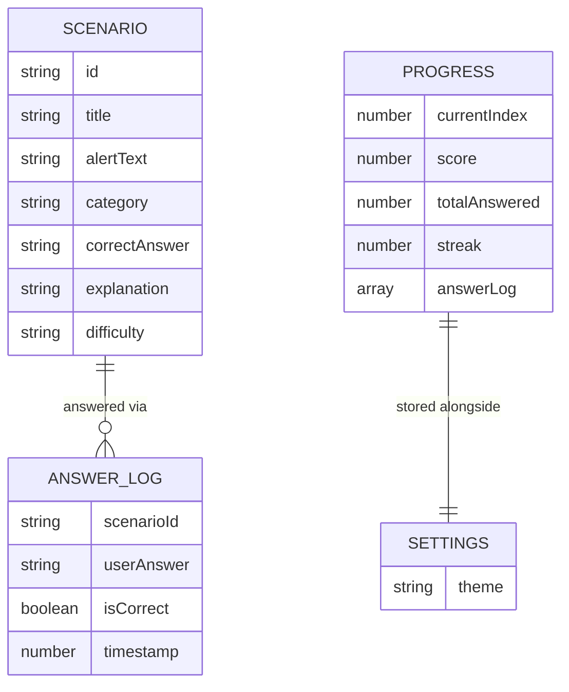

# SCHEMA.md — TRIAGE//44

**Note:** Per the confirmed client-side-only architecture, there is no database or backend. This document defines the **data schema** for the two data sources that exist: the static scenario dataset (`scenarios.json`) and the localStorage progress/settings state. This replaces a traditional DB schema for this project.

---

## 1. Entity Overview



## 2. `scenarios.json` — Scenario Entity

Static, bundled with the app. 44 entries.

| Field | Type | Required | Notes |
|---|---|---|---|
| `id` | string | Yes | Unique, e.g. `"scn-001"` |
| `title` | string | Yes | Short label, e.g. "Unusual Login Time" |
| `alertText` | string | Yes | The realistic alert/log snippet shown to the user |
| `category` | enum | Yes | One of: `"malicious"`, `"benign"`, `"needs_investigation"` — this IS the correct answer |
| `explanation` | string | Yes | Shown after answering; must justify the classification with reference to the alert details |
| `difficulty` | enum | Yes | `"beginner"` \| `"intermediate"` — used for potential future filtering, not required for v1 UI |

**Validation rules:**
- `id` must be unique across all 44 entries
- `category` must be exactly one of the 3 enum values (no free text)
- `explanation` must not be empty
- Total count must equal 44 (enforced by a simple length check at build/test time, not runtime)

**Sample record:**
```json
{
  "id": "scn-001",
  "title": "Unusual Login Time",
  "alertText": "User 'jsmith' logged in from IP 41.203.x.x at 03:14 AM, a time with no prior login history for this account. Login succeeded on first attempt.",
  "category": "needs_investigation",
  "explanation": "An off-hours login from a new/unusual IP with no prior baseline is not automatically malicious, but it deviates enough from normal behavior to warrant investigation — check geolocation, VPN usage, and whether the user was traveling before deciding malicious vs. benign.",
  "difficulty": "beginner"
}
```

## 3. `localStorage` — Progress Entity

Key: `triage44_progress`

| Field | Type | Required | Notes |
|---|---|---|---|
| `currentIndex` | number | Yes | Index of the scenario currently in progress (0–43) |
| `score` | number | Yes | Count of correct answers so far |
| `totalAnswered` | number | Yes | Count of scenarios answered so far |
| `streak` | number | Yes | Current consecutive-correct streak |
| `answerLog` | array of `AnswerLog` | Yes | One entry per answered scenario, for the summary screen |
| `completedAt` | string (ISO date) or `null` | No | Set when all 44 are completed |

**`AnswerLog` sub-entity:**

| Field | Type | Notes |
|---|---|---|
| `scenarioId` | string | References `scenarios.json` id |
| `userAnswer` | enum | User's selected classification |
| `isCorrect` | boolean | Derived at answer time |
| `timestamp` | number (epoch ms) | For potential future "time per question" stats |

**Sample record:**
```json
{
  "currentIndex": 12,
  "score": 9,
  "totalAnswered": 12,
  "streak": 3,
  "answerLog": [
    { "scenarioId": "scn-001", "userAnswer": "needs_investigation", "isCorrect": true, "timestamp": 1735689000000 }
  ],
  "completedAt": null
}
```

## 4. `localStorage` — Settings Entity

Key: `triage44_settings`

| Field | Type | Required | Notes |
|---|---|---|---|
| `theme` | enum | Yes | `"dark"` \| `"light"`, defaults to `"dark"` |

## 5. Naming Conventions

- localStorage keys: `triage44_<entity>` (namespaced to avoid collisions with other tools sharing the same domain/host, e.g. GitHub Pages user site)
- JSON fields: `camelCase`
- Enum values: `snake_case` string literals (`needs_investigation`, not `NeedsInvestigation`) — kept consistent between data file and app logic

## 6. Data Lifecycle

- **Scenario data:** read-only at runtime, loaded once on app init, never mutated
- **Progress data:** created on first answer, updated after every answer, cleared only via explicit "Reset Progress" action (no auto-expiry)
- **Settings data:** created on first theme interaction (or defaulted on first load), updated on toggle

## 7. Validation Against PRD User Stories

| User Story | Covered By |
|---|---|
| See one alert at a time | `currentIndex` in Progress + Scenario entity ordering |
| Know immediately if right/wrong + why | `isCorrect` computed at answer time + `explanation` field on Scenario |
| See overall accuracy | Derived from `score` / `totalAnswered` |
| Progress saved across reloads | `triage44_progress` persisted to localStorage |
| Theme toggle | `triage44_settings.theme` |

No PRD requirement is left uncovered by this schema.
