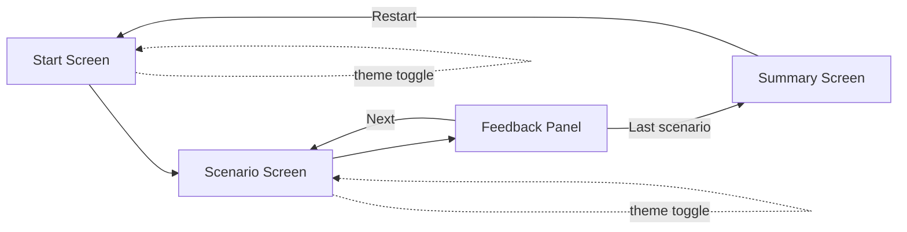
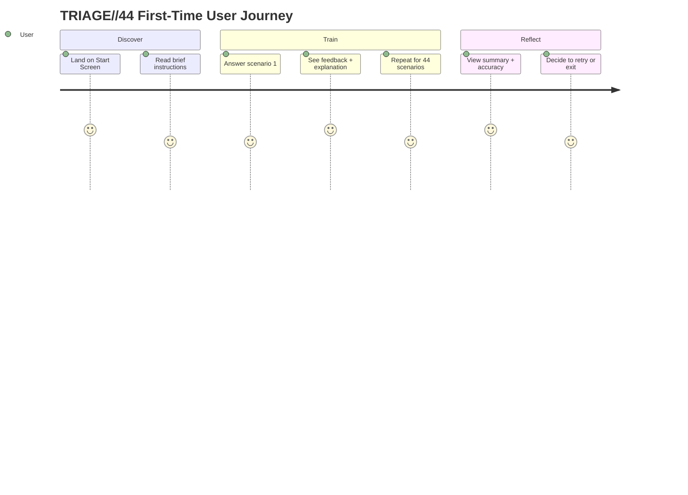

# UI-WIREFRAMES.md — TRIAGE//44

## 1. Navigation Map



## 2. User Journey



## 3. Start Screen (Desktop)

```
┌──────────────────────────────────────────────────┐
│  TRIAGE//44                          [🌙 Theme]   │
├──────────────────────────────────────────────────┤
│                                                    │
│        SOC Alert Classification Training          │
│                                                    │
│   Classify 44 realistic SOC alerts as:            │
│   Malicious · Benign · Needs Investigation         │
│                                                    │
│   Progress saved automatically on this device.    │
│                                                    │
│         [ Start Training ]   [ Resume (12/44) ]   │
│           (Resume button only shown if             │
│            saved progress exists)                  │
│                                                    │
└──────────────────────────────────────────────────┘
```

## 4. Scenario Screen (Desktop)

```
┌──────────────────────────────────────────────────┐
│  TRIAGE//44          Score: 9/12  Streak: 3  [🌙] │
├──────────────────────────────────────────────────┤
│  Scenario 13 of 44          [███████░░░░░░░] 27%  │
│                                                    │
│  ┌──────────────────────────────────────────┐    │
│  │ ALERT: Unusual Login Time                 │    │
│  │                                            │    │
│  │ User 'jsmith' logged in from IP 41.203.x.x│    │
│  │ at 03:14 AM, no prior login history for   │    │
│  │ this account. Login succeeded on first    │    │
│  │ attempt.                                  │    │
│  └──────────────────────────────────────────┘    │
│                                                    │
│  How would you classify this alert?               │
│                                                    │
│  [ Malicious ]  [ Benign ]  [ Needs Investigation ]│
│                                                    │
└──────────────────────────────────────────────────┘
```

## 5. Feedback Panel (appears in place of the buttons after answering)

```
┌──────────────────────────────────────────────────┐
│  ✅ Correct — you selected "Needs Investigation"   │
│                                                    │
│  Why: An off-hours login from a new/unusual IP    │
│  with no prior baseline isn't automatically       │
│  malicious, but the deviation from normal          │
│  behavior warrants investigation — check           │
│  geolocation, VPN use, and travel status.          │
│                                                    │
│                            [ Next Scenario → ]     │
└──────────────────────────────────────────────────┘
```

Incorrect state uses the same layout with `❌ Incorrect — the correct answer was "X"` and the same explanation block (explanation is always shown, correct or not — core to the learning goal).

## 6. Summary Screen

```
┌──────────────────────────────────────────────────┐
│  TRIAGE//44 — Training Complete                  │
├──────────────────────────────────────────────────┤
│                                                    │
│           Final Accuracy: 84% (37/44)             │
│                                                    │
│           [ Accuracy chart / bar by category ]    │
│                                                    │
│   Malicious:  92%   Benign: 80%   Needs Inv: 79%  │
│                                                    │
│         [ Restart Training ]  [ Reset Progress ]  │
│                                                    │
└──────────────────────────────────────────────────┘
```

## 7. Mobile Layout (Scenario Screen, ≤480px)

```
┌───────────────────┐
│ TRIAGE//44   [🌙]  │
│ Score 9/12 · 27%   │
├───────────────────┤
│ Scenario 13 of 44  │
│ ┌───────────────┐  │
│ │ Unusual Login │  │
│ │ Time          │  │
│ │               │  │
│ │ User 'jsmith' │  │
│ │ logged in...  │  │
│ └───────────────┘  │
│                    │
│ [ Malicious ]      │
│ [ Benign ]         │
│ [ Needs            │
│   Investigation ]  │
└───────────────────┘
```

Buttons stack vertically on mobile (full-width, min 44px tap target height) instead of the 3-across desktop row.

## 8. States

- **Loading state:** shown briefly on first load while `scenarios.json` parses — simple centered spinner + "Loading scenarios…"
- **Empty state:** not applicable (content is always present in v1 — no empty state needed since there's no user-generated content)
- **Error state:** full-panel message — "Couldn't load training scenarios." + `[ Retry ]` button (maps to ARCHITECTURE.md §9 error flow)
- **Reset confirmation:** modal — "Reset all progress? This can't be undone." + `[ Cancel ]` `[ Reset ]`

## 9. Accessibility Notes

- All classification buttons keyboard-navigable (native `<button>` elements, not `<div>`)
- Color is never the only indicator of correct/incorrect — icon (✅/❌) + text label always present
- Minimum contrast ratio 4.5:1 maintained in both dark and light themes
- Progress bar has an `aria-label` announcing "13 of 44 complete"
